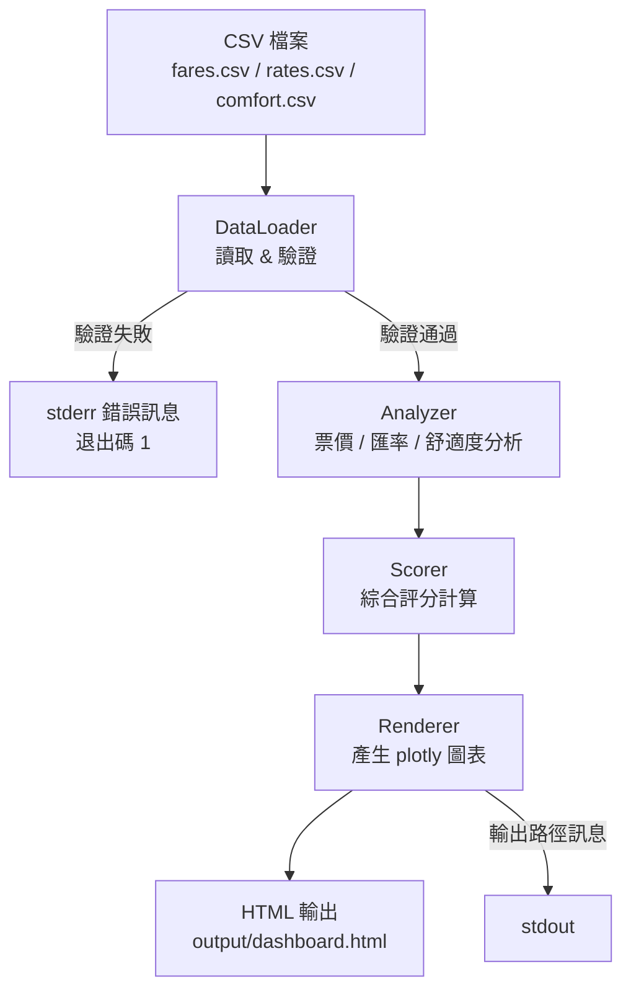
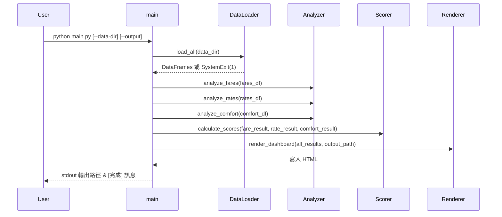

# 設計文件：日本旅遊最佳出發時機分析 Dashboard

## 概覽（Overview）

本系統是一個以 Python 為核心的靜態分析工具，從 CSV 檔案讀取台灣飛日本的機票票價、JPY/TWD 匯率及旅遊舒適度資料，透過 pandas 進行資料處理與評分計算，再以 plotly 產生互動式圖表，最終輸出單一可離線瀏覽的 HTML Dashboard 檔案。

### 設計目標

- **單一命令執行**：使用者只需執行 `python main.py` 即可完成全部分析流程並產生 Dashboard。
- **離線可用**：輸出的 HTML 檔案內嵌 plotly JS 資源，無需網路即可在瀏覽器中開啟。
- **可維護性**：各功能模組職責分離，便於獨立測試與擴充。
- **明確的錯誤回報**：所有資料驗證錯誤與警告均輸出至 stderr，並附帶足夠的定位資訊（列號、欄位名稱）。

### 技術棧

| 元件 | 技術 |
|------|------|
| 主要語言 | Python 3.10+ |
| 資料處理 | pandas |
| 圖表產生 | plotly |
| 資料儲存 | CSV 檔案 |
| 輸出格式 | 靜態 HTML |

### 排除項目（MVP 第一版）

- Docker / 容器化
- 資料庫（SQLite、PostgreSQL 等）
- Web 框架（FastAPI、Flask）
- 前端框架（React、Vue）
- 機器學習模型
- 自動排程 / 背景常駐程式

---

## 架構（Architecture）

### 整體資料流



### 執行流程（main.py）



### 模組職責

| 模組 | 檔案 | 職責 |
|------|------|------|
| `main` | `main.py` | CLI 入口、流程協調、進度訊息輸出 |
| `DataLoader` | `src/data_loader.py` | CSV 讀取、欄位驗證、資料列驗證、警告輸出 |
| `Analyzer` | `src/analyzer.py` | 票價分析、匯率分析、舒適度分析 |
| `Scorer` | `src/scorer.py` | 綜合評分計算（票價分數、匯率分數、舒適度分數） |
| `Renderer` | `src/renderer.py` | plotly 圖表產生、HTML 組裝與輸出 |

---

## 元件與介面（Components and Interfaces）

### DataLoader

```python
class DataLoader:
    def __init__(self, data_dir: str = "data"):
        ...

    def load_all(self) -> tuple[pd.DataFrame, pd.DataFrame, pd.DataFrame]:
        """
        回傳 (fares_df, rates_df, comfort_df)。
        任一 CSV 不存在或必要欄位缺失時，輸出 stderr 並 sys.exit(1)。
        無效資料列輸出 stderr 警告並略過。
        """

    def _load_fares(self) -> pd.DataFrame: ...
    def _load_rates(self) -> pd.DataFrame: ...
    def _load_comfort(self) -> pd.DataFrame: ...
    def _validate_row_fares(self, row: pd.Series, row_num: int) -> bool: ...
    def _validate_row_rates(self, row: pd.Series, row_num: int) -> bool: ...
    def _validate_row_comfort(self, row: pd.Series, row_num: int) -> bool: ...
```

**欄位規格**

| CSV | 必要欄位 | 型別 | 驗證規則 |
|-----|----------|------|----------|
| `fares.csv` | `date`, `airline`, `origin`, `destination`, `roundtrip_fare_twd` | str, str, str, str, int | date: YYYY-MM-DD；airline: CI/BR/JX；fare > 0 |
| `rates.csv` | `date`, `jpy_twd_rate` | str, float | date: YYYY-MM-DD；rate > 0 |
| `comfort.csv` | `month`, `city`, `avg_temp_c`, `rain_probability_pct`, `crowd_index` | int, str, float, int, int | month: 1–12；rain: 0–100；crowd: 1–10 |

### Analyzer

```python
class Analyzer:
    def analyze_fares(self, fares_df: pd.DataFrame) -> FareAnalysisResult:
        """
        回傳各航空公司月均票價（airline × month）及各月最低票價。
        """

    def analyze_rates(self, rates_df: pd.DataFrame) -> RateAnalysisResult:
        """
        回傳月均匯率、全年平均匯率、最佳換匯月份清單。
        """

    def analyze_comfort(self, comfort_df: pd.DataFrame) -> ComfortAnalysisResult:
        """
        回傳各城市各月份的 avg_temp_c、rain_probability_pct、crowd_index 平均值。
        """
```

### Scorer

```python
class Scorer:
    def calculate_scores(
        self,
        fare_result: FareAnalysisResult,
        rate_result: RateAnalysisResult,
        comfort_result: ComfortAnalysisResult,
    ) -> ScoreResult:
        """
        計算票價分數、匯率分數、舒適度分數及綜合評分（月份 1–12）。
        缺少票價資料的月份，綜合評分填入 NaN。
        """
```

### Renderer

```python
class Renderer:
    def render_dashboard(
        self,
        fare_result: FareAnalysisResult,
        rate_result: RateAnalysisResult,
        comfort_result: ComfortAnalysisResult,
        score_result: ScoreResult,
        output_path: str = "output/dashboard.html",
    ) -> None:
        """
        產生所有 plotly 圖表並組裝為單一 HTML 檔案。
        輸出完成後於 stdout 顯示「輸出路徑：{絕對路徑}」。
        """

    def _build_fare_chart(self, fare_result: FareAnalysisResult) -> go.Figure: ...
    def _build_rate_chart(self, rate_result: RateAnalysisResult) -> go.Figure: ...
    def _build_comfort_heatmap(self, comfort_result: ComfortAnalysisResult) -> go.Figure: ...
    def _build_comfort_rain_chart(self, comfort_result: ComfortAnalysisResult) -> go.Figure: ...
    def _build_score_chart(self, score_result: ScoreResult) -> go.Figure: ...
    def _assemble_html(self, figures: list[go.Figure], output_path: str) -> None: ...
```

### CLI 介面（main.py）

```
usage: main.py [-h] [--data-dir DATA_DIR] [--output OUTPUT]

選項：
  --data-dir DATA_DIR   CSV 資料目錄（預設：data）
  --output OUTPUT       HTML 輸出路徑（預設：output/dashboard.html）
```

---

## 資料模型（Data Models）

### 輸入資料結構

#### Fare_Record（fares.csv 的一列）

| 欄位 | 型別 | 說明 |
|------|------|------|
| `date` | `str` (YYYY-MM-DD) | 票價查詢日期 |
| `airline` | `str` (CI/BR/JX) | 航空公司代碼 |
| `origin` | `str` (IATA) | 出發機場代碼 |
| `destination` | `str` (IATA) | 目的地機場代碼 |
| `roundtrip_fare_twd` | `int` (> 0) | 來回票價（新台幣） |

#### Rate_Record（rates.csv 的一列）

| 欄位 | 型別 | 說明 |
|------|------|------|
| `date` | `str` (YYYY-MM-DD) | 匯率日期 |
| `jpy_twd_rate` | `float` (> 0) | JPY/TWD 匯率 |

#### Comfort_Record（comfort.csv 的一列）

| 欄位 | 型別 | 說明 |
|------|------|------|
| `month` | `int` (1–12) | 月份 |
| `city` | `str` | 目的地城市名稱 |
| `avg_temp_c` | `float` | 平均氣溫（°C） |
| `rain_probability_pct` | `int` (0–100) | 降雨機率（%） |
| `crowd_index` | `int` (1–10) | 觀光人潮指數 |

### 分析結果資料結構

```python
from dataclasses import dataclass, field
import pandas as pd

@dataclass
class FareAnalysisResult:
    # index: month (1–12), columns: airline (CI, BR, JX)
    monthly_avg_by_airline: pd.DataFrame
    # index: month (1–12), value: 最低票價 (int or NaN)
    monthly_min_fare: pd.Series

@dataclass
class RateAnalysisResult:
    # index: month (1–12), value: 月均匯率 (float or NaN)
    monthly_avg_rate: pd.Series
    # 全年平均匯率（所有月份均值）
    annual_avg_rate: float
    # 最佳換匯月份清單（可能多個）
    best_months: list[int]

@dataclass
class ComfortAnalysisResult:
    # MultiIndex: (city, month)，columns: avg_temp_c, rain_probability_pct, crowd_index
    monthly_comfort: pd.DataFrame

@dataclass
class ScoreResult:
    # index: month (1–12)
    fare_score: pd.Series       # 0–100 or NaN
    rate_score: pd.Series       # 0–100 or NaN
    comfort_score: pd.Series    # 0–100 or NaN
    total_score: pd.Series      # 0–100 or NaN（缺票價資料時為 NaN）
```

### 評分公式

```
票價分數(m)   = 100 × (max_min_fare − min_fare(m)) ÷ (max_min_fare − min_min_fare)
               若分母 = 0，則所有月份設為 50.0

匯率分數(m)   = 100 × (avg_rate(m) − min_avg_rate) ÷ (max_avg_rate − min_avg_rate)
               若分母 = 0，則所有月份設為 50.0

舒適度分數(m) = 100 × (1 − (avg_rain(m) ÷ 100) × 0.5 − (avg_crowd(m) ÷ 10) × 0.5)
               結果 clip 至 [0, 100]

綜合評分(m)   = 票價分數(m) × 0.4 + 匯率分數(m) × 0.3 + 舒適度分數(m) × 0.3
               四捨五入至小數點後一位；缺票價資料時為 NaN
```

### 專案目錄結構

```
japan-travel-dashboard/
├── main.py                  # CLI 入口
├── src/
│   ├── __init__.py
│   ├── data_loader.py       # DataLoader
│   ├── analyzer.py          # Analyzer
│   ├── scorer.py            # Scorer
│   └── renderer.py          # Renderer
├── data/
│   ├── fares.csv
│   ├── rates.csv
│   └── comfort.csv
├── output/                  # 自動建立
│   └── dashboard.html
├── tests/
│   ├── test_data_loader.py
│   ├── test_analyzer.py
│   ├── test_scorer.py
│   └── test_renderer.py
└── requirements.txt
```

---

## 正確性屬性（Correctness Properties）

*屬性（Property）是指在系統所有有效執行情境下都應成立的特性或行為——本質上是對系統應做什麼的形式化陳述。屬性作為人類可讀規格與機器可驗證正確性保證之間的橋樑。*

---

### Property 1：無效資料列略過並輸出含列號警告

*對任意* 包含無效資料列的 CSV 輸入（無效票價值、無效匯率值、無效日期格式、非法 airline 代碼），DataLoader 應略過所有無效列，且 stderr 警告訊息中應包含對應的 CSV 列號（從 2 開始計）。

**Validates: Requirements 1.6, 1.7, 1.10**

---

### Property 2：欄位範圍驗證略過並輸出含欄位名稱警告

*對任意* 包含超出範圍欄位值的 Comfort_Record（crowd_index 超出 1–10、rain_probability_pct 超出 0–100、month 超出 1–12），DataLoader 應略過該筆資料，且 stderr 警告訊息中應包含所有超出範圍的欄位名稱。

**Validates: Requirements 1.8**

---

### Property 3：非法 airline 代碼略過並輸出含實際值警告

*對任意* airline 欄位值不屬於 CI、BR、JX 的 Fare_Record，DataLoader 應略過該筆資料，且 stderr 警告訊息中應包含實際讀取到的值。

**Validates: Requirements 1.9**

---

### Property 4：缺少必要欄位時錯誤訊息列出所有缺少欄位

*對任意* 缺少必要欄位的子集（從必要欄位中移除任意非空子集），DataLoader 應輸出至 stderr 的錯誤訊息中包含所有缺少的欄位名稱。

**Validates: Requirements 1.5**

---

### Property 5：月均票價分組計算正確性

*對任意* 有效 Fare_Record 集合，Analyzer 計算的各航空公司月均票價應等於對應分組的算術平均值，且結果四捨五入至整數；缺少資料的航空公司-月份組合應填入 NaN 而非 0。

**Validates: Requirements 2.1, 2.3**

---

### Property 6：月最低票價計算正確性

*對任意* 有效 Fare_Record 集合，Analyzer 計算的每月最低票價應等於該月所有有效記錄中 roundtrip_fare_twd 的最小值；無資料的月份應填入 NaN。

**Validates: Requirements 2.2, 2.3**

---

### Property 7：月均匯率計算正確性與最佳月份識別

*對任意* 有效 Rate_Record 集合，Analyzer 計算的月均匯率應等於對應月份所有記錄的算術平均值（保留四位小數）；best_months 應包含且僅包含所有月均匯率最大值的月份（含並列情況）。

**Validates: Requirements 3.1, 3.2**

---

### Property 8：舒適度指標分組計算精度正確性

*對任意* 有效 Comfort_Record 集合，Analyzer 計算的各城市月均指標應符合精度規格：avg_temp_c 保留一位小數、rain_probability_pct 四捨五入至整數、crowd_index 四捨五入至一位小數。

**Validates: Requirements 4.1**

---

### Property 9：分數正規化公式正確性（含分母為零邊界）

*對任意* 有效月均最低票價序列或月均匯率序列，Scorer 計算的正規化分數應等於公式計算結果（值域 0–100）；當所有月份數值相同（分母為零）時，所有月份分數應設為 50.0。

**Validates: Requirements 5.1, 5.2**

---

### Property 10：舒適度分數公式正確性與值域限制

*對任意* 有效的 rain_probability_pct（0–100）和 crowd_index（1–10）組合，Scorer 計算的舒適度分數應等於公式計算結果，且結果必須在 [0, 100] 範圍內（clip 後）。

**Validates: Requirements 5.3**

---

### Property 11：綜合評分加權計算正確性與 NaN 傳播

*對任意* 有效的票價分數、匯率分數、舒適度分數組合，Scorer 計算的綜合評分應等於加權公式結果（四捨五入至一位小數）；當票價分數為 NaN 的月份，對應綜合評分應為 NaN。

**Validates: Requirements 5.4, 5.5**

---

### Property 12：評分顏色分類正確性

*對任意* 有效評分值（0–100），Renderer 為長條圖指定的顏色應符合分類規格：評分 ≥ 70 使用綠色系、40–69 使用黃色系、< 40 使用紅色系。

**Validates: Requirements 5.6**

---

### Property 13：最佳月份標籤格式正確性

*對任意* 有效評分序列（至少一個非 NaN 值），Renderer 在綜合評分圖上標示的最高分月份標籤應符合「最佳月份：{n}月（{score}分）」格式，且 n 為實際最高分月份，score 為對應評分。

**Validates: Requirements 5.7**

---

### Property 14：票價最低點標籤格式正確性

*對任意* 有效的航空公司月均票價資料，Renderer 在折線圖上標示的最低票價點標籤應符合「TWD {整數}」格式（無千分位符號）。

**Validates: Requirements 2.5**

---

### Property 15：熱力圖溫度標籤格式正確性

*對任意* 有效的 avg_temp_c 值，Renderer 在熱力圖格子內顯示的標籤應符合「{x.x}°C」格式（保留一位小數）。

**Validates: Requirements 4.4**

---

### Property 16：HTML 輸出路徑訊息格式正確性

*對任意* 輸出路徑，Renderer 在 HTML 寫入嘗試完成後於 stdout 顯示的訊息應符合「輸出路徑：{絕對路徑}」格式。

**Validates: Requirements 6.7**

---

### Property 17：CLI 進度與錯誤訊息格式正確性

*對任意* 成功完成的分析階段，stdout 應包含「[完成] {階段名稱}」格式的訊息；*對任意* 導致流程終止的錯誤，stderr 應包含「[錯誤] {錯誤原因}」格式的訊息且退出碼為 1。

**Validates: Requirements 7.5, 7.6**

---

### Property 18：HTML header 日期格式正確性

*對任意* 系統執行日期，Renderer 產生的 HTML header 應包含標題「日本旅遊最佳出發時機分析」及符合 YYYY-MM-DD 格式的當日日期。

**Validates: Requirements 6.3**

---

## 錯誤處理（Error Handling）

### 錯誤分類與處理策略

| 錯誤類型 | 嚴重程度 | 處理方式 | 輸出目標 | 退出碼 |
|----------|----------|----------|----------|--------|
| CSV 檔案不存在 | 致命 | 立即終止 | stderr | 1 |
| CSV 必要欄位缺失 | 致命 | 立即終止 | stderr | 1 |
| 資料列欄位值無效 | 警告 | 略過該列，繼續執行 | stderr | — |
| 輸出目錄建立失敗 | 致命 | 立即終止 | stderr | 1 |
| HTML 寫入失敗 | 致命 | 立即終止 | stderr | 1 |
| --data-dir 路徑不存在 | 致命 | 立即終止 | stderr | 1 |

### 錯誤訊息格式規範

```
# 致命錯誤（stderr）
[錯誤] {錯誤原因}

# 資料列警告（stderr）
[警告] {CSV 檔名} 第 {列號} 列：{具體原因}（例：airline 值 'XX' 不在允許清單中）

# 進度訊息（stdout）
[完成] {階段名稱}

# 輸出路徑（stdout）
輸出路徑：{絕對路徑}
```

### 資料列驗證警告範例

```
[警告] fares.csv 第 5 列：roundtrip_fare_twd 為非正整數（值：-100）
[警告] fares.csv 第 8 列：airline 值 'ANA' 不在允許清單中（CI/BR/JX）
[警告] rates.csv 第 3 列：date 格式不符合 YYYY-MM-DD（值：'2024/01/15'）
[警告] comfort.csv 第 12 列：crowd_index 超出範圍 1–10（值：15）；rain_probability_pct 超出範圍 0–100（值：110）
```

### 分析階段的 NaN 傳播規則

```
fares.csv 缺少某月資料
  → FareAnalysisResult.monthly_min_fare[month] = NaN
  → ScoreResult.fare_score[month] = NaN
  → ScoreResult.total_score[month] = NaN
  → Renderer 在綜合評分圖中以灰色長條標示「資料不足」

rates.csv 缺少某月資料
  → RateAnalysisResult.monthly_avg_rate[month] = NaN
  → Renderer 在匯率折線圖中以斷線呈現（connectgaps=False）
  → ScoreResult.rate_score[month] = NaN（但不影響綜合評分，除非票價也缺失）

comfort.csv 缺少某城市某月資料
  → ComfortAnalysisResult.monthly_comfort[(city, month)] = NaN
  → Renderer 在熱力圖對應格子顯示「N/A」並以灰色填充
```

---

## 測試策略（Testing Strategy）

### 測試框架

| 工具 | 用途 |
|------|------|
| `pytest` | 單元測試與整合測試框架 |
| `hypothesis` | 屬性測試（Property-Based Testing）框架 |
| `pytest-cov` | 測試覆蓋率報告 |

### 雙軌測試方法

本專案採用**單元測試**與**屬性測試**並行的策略：

- **單元測試**：驗證具體範例、邊界條件、錯誤處理行為
- **屬性測試**：驗證對所有有效輸入均成立的普遍性質

### 屬性測試配置

使用 `hypothesis` 函式庫實作屬性測試：

```python
from hypothesis import given, settings
from hypothesis import strategies as st

@settings(max_examples=100)
@given(...)
def test_property_N_description(...):
    # Feature: japan-travel-dashboard, Property N: {property_text}
    ...
```

每個屬性測試最少執行 **100 次迭代**（`max_examples=100`）。

### 各模組測試重點

#### `tests/test_data_loader.py`

**屬性測試（hypothesis）：**
- Property 1：無效資料列略過並輸出含列號警告
- Property 2：欄位範圍驗證略過並輸出含欄位名稱警告
- Property 3：非法 airline 代碼略過並輸出含實際值警告
- Property 4：缺少必要欄位時錯誤訊息列出所有缺少欄位

**單元測試（pytest）：**
- CSV 檔案不存在時的錯誤訊息與退出碼
- 三個 CSV 各自缺失的情況
- 正常資料的完整讀取

#### `tests/test_analyzer.py`

**屬性測試（hypothesis）：**
- Property 5：月均票價分組計算正確性（含 NaN 填充）
- Property 6：月最低票價計算正確性
- Property 7：月均匯率計算正確性與最佳月份識別
- Property 8：舒適度指標分組計算精度正確性

**單元測試（pytest）：**
- 某航空公司所有月份均無資料的情況
- 某月份無匯率資料的 NaN 處理
- 某城市某月份無舒適度資料的 NaN 處理

#### `tests/test_scorer.py`

**屬性測試（hypothesis）：**
- Property 9：分數正規化公式正確性（含分母為零邊界）
- Property 10：舒適度分數公式正確性與值域限制
- Property 11：綜合評分加權計算正確性與 NaN 傳播

**單元測試（pytest）：**
- 所有月份票價相同（分母為零）→ 票價分數全為 50.0
- 所有月份匯率相同（分母為零）→ 匯率分數全為 50.0
- 缺少票價資料的月份 → 綜合評分為 NaN

#### `tests/test_renderer.py`

**屬性測試（hypothesis）：**
- Property 12：評分顏色分類正確性
- Property 13：最佳月份標籤格式正確性
- Property 14：票價最低點標籤格式正確性
- Property 15：熱力圖溫度標籤格式正確性
- Property 16：HTML 輸出路徑訊息格式正確性
- Property 18：HTML header 日期格式正確性

**單元測試（pytest）：**
- 折線圖包含正確數量的 traces
- 熱力圖 zmin/zmax 等於資料集實際最小/最大值
- 某航空公司完全無資料時圖例顯示灰色「無資料」
- 缺失月份在匯率折線圖中以斷線呈現（connectgaps=False）
- 缺失格子在熱力圖顯示「N/A」並以灰色填充
- HTML 包含四個 section 元素且順序正確
- 輸出 HTML 不包含 cdn.plot.ly 外部連結
- 輸出目錄不存在時自動建立

#### `tests/test_main.py`（整合測試）

**單元測試（pytest）：**
- `--help` 輸出包含所有參數說明，退出碼 0
- `--data-dir` 指定有效路徑正常執行
- `--data-dir` 指定不存在路徑輸出錯誤，退出碼 1
- `--output` 指定路徑後 HTML 輸出至該路徑

**屬性測試（hypothesis）：**
- Property 17：CLI 進度與錯誤訊息格式正確性

**整合測試（pytest）：**
- 使用完整測試資料集執行 `python main.py`，驗證所有 `[完成]` 訊息依序出現，退出碼 0

### 測試資料策略

- **固定測試資料**：`tests/fixtures/` 目錄下存放小型 CSV 測試檔案，涵蓋正常資料、邊界值、缺失值等情況
- **hypothesis 生成器**：為各資料模型定義自訂 `st.composite` 策略，生成符合業務規則的隨機資料
- **測試隔離**：使用 `tmp_path` fixture 確保每個測試的輸出目錄互不干擾

### hypothesis 自訂策略範例

```python
from hypothesis import strategies as st

# 有效 Fare_Record 策略
valid_fare_record = st.fixed_dictionaries({
    "date": st.dates(
        min_value=date(2023, 1, 1),
        max_value=date(2025, 12, 31)
    ).map(lambda d: d.strftime("%Y-%m-%d")),
    "airline": st.sampled_from(["CI", "BR", "JX"]),
    "origin": st.text(alphabet=st.characters(whitelist_categories=("Lu",)), min_size=3, max_size=3),
    "destination": st.text(alphabet=st.characters(whitelist_categories=("Lu",)), min_size=3, max_size=3),
    "roundtrip_fare_twd": st.integers(min_value=1, max_value=200000),
})

# 有效 Rate_Record 策略
valid_rate_record = st.fixed_dictionaries({
    "date": st.dates(
        min_value=date(2023, 1, 1),
        max_value=date(2025, 12, 31)
    ).map(lambda d: d.strftime("%Y-%m-%d")),
    "jpy_twd_rate": st.floats(min_value=0.001, max_value=1.0, allow_nan=False),
})

# 有效 Comfort_Record 策略
valid_comfort_record = st.fixed_dictionaries({
    "month": st.integers(min_value=1, max_value=12),
    "city": st.text(min_size=1, max_size=20),
    "avg_temp_c": st.floats(min_value=-20.0, max_value=45.0, allow_nan=False),
    "rain_probability_pct": st.integers(min_value=0, max_value=100),
    "crowd_index": st.integers(min_value=1, max_value=10),
})
```

### 覆蓋率目標

| 模組 | 目標覆蓋率 |
|------|-----------|
| `src/data_loader.py` | ≥ 90% |
| `src/analyzer.py` | ≥ 90% |
| `src/scorer.py` | ≥ 95% |
| `src/renderer.py` | ≥ 80% |
| `main.py` | ≥ 85% |
