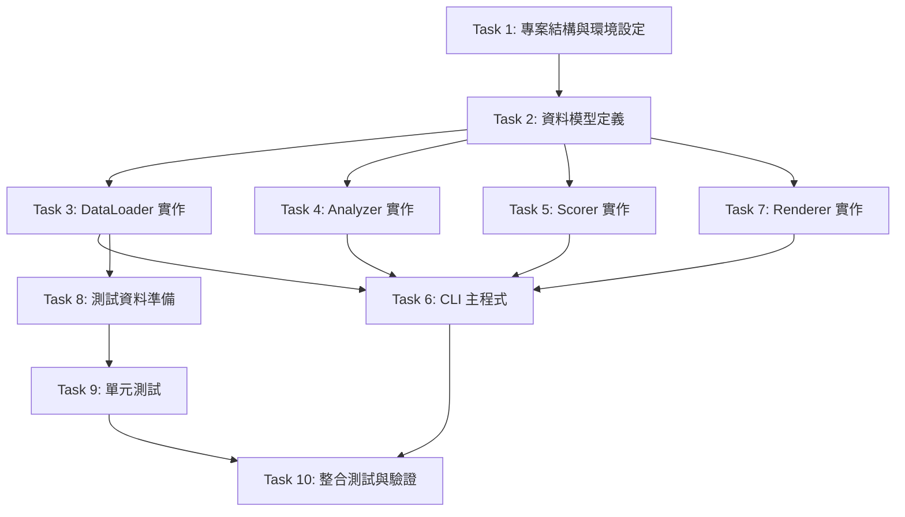

# 實作任務清單

## 專案概覽

本專案為「日本旅遊最佳出發時機分析 Dashboard」，一個 Python 靜態分析工具，從 CSV 讀取票價、匯率與舒適度資料，產生互動式 HTML Dashboard。

**技術棧：** Python 3.10+, pandas, plotly, pytest  
**目標：** 乾淨、模組化、可擴展的作品集專案

---

## 任務依賴關係圖



---

## Task 1: 專案結構與環境設定

**目標：** 建立專案目錄結構與開發環境

### 子任務

#### 1.1 建立目錄結構
建立以下目錄與檔案：
```
japan-travel-dashboard/
├── main.py
├── requirements.txt
├── README.md
├── .gitignore
├── src/
│   ├── __init__.py
│   ├── data_loader.py
│   ├── analyzer.py
│   ├── scorer.py
│   ├── renderer.py
│   └── models.py
├── data/
│   ├── .gitkeep
│   └── README.md
├── output/
│   └── .gitkeep
└── tests/
    ├── __init__.py
    ├── fixtures/
    │   └── .gitkeep
    ├── test_data_loader.py
    ├── test_analyzer.py
    ├── test_scorer.py
    └── test_renderer.py
```

#### 1.2 建立 requirements.txt
```txt
pandas>=2.0.0
plotly>=5.14.0
pytest>=7.3.0
pytest-cov>=4.1.0
```

#### 1.3 建立 .gitignore
```
__pycache__/
*.py[cod]
*$py.class
*.so
.Python
env/
venv/
*.egg-info/
dist/
build/
output/*.html
.pytest_cache/
.coverage
htmlcov/
.DS_Store
```

#### 1.4 建立 README.md
包含：
- 專案簡介
- 安裝指令（`pip install -r requirements.txt`）
- 使用方式（`python main.py`）
- CSV 資料格式說明
- 輸出範例

**驗收標準：**
- 所有目錄與檔案已建立
- `pip install -r requirements.txt` 可成功執行
- README 清楚說明專案用途與使用方式

---

## Task 2: 資料模型定義

**目標：** 定義分析結果的資料結構

### 子任務

#### 2.1 建立 src/models.py
定義以下 dataclass：

```python
from dataclasses import dataclass
import pandas as pd

@dataclass
class FareAnalysisResult:
    """票價分析結果"""
    monthly_avg_by_airline: pd.DataFrame  # index: month, columns: airline
    monthly_min_fare: pd.Series           # index: month

@dataclass
class RateAnalysisResult:
    """匯率分析結果"""
    monthly_avg_rate: pd.Series  # index: month
    annual_avg_rate: float
    best_months: list[int]

@dataclass
class ComfortAnalysisResult:
    """舒適度分析結果"""
    monthly_comfort: pd.DataFrame  # MultiIndex: (city, month)

@dataclass
class ScoreResult:
    """綜合評分結果"""
    fare_score: pd.Series      # index: month
    rate_score: pd.Series      # index: month
    comfort_score: pd.Series   # index: month
    total_score: pd.Series     # index: month
```

**驗收標準：**
- 所有 dataclass 已定義
- 包含型別註解與 docstring
- 可成功 import

---

## Task 3: DataLoader 實作

**目標：** 實作 CSV 讀取與資料驗證

### 子任務

#### 3.1 實作 DataLoader 類別骨架
```python
class DataLoader:
    def __init__(self, data_dir: str = "data"):
        self.data_dir = data_dir
    
    def load_all(self) -> tuple[pd.DataFrame, pd.DataFrame, pd.DataFrame]:
        """載入所有 CSV 並回傳 (fares_df, rates_df, comfort_df)"""
        pass
```

#### 3.2 實作 CSV 檔案存在性檢查
- 檢查 `fares.csv`, `rates.csv`, `comfort.csv` 是否存在
- 若不存在，輸出錯誤至 stderr 並 `sys.exit(1)`
- 錯誤格式：`[錯誤] 找不到檔案：{完整路徑}`

#### 3.3 實作欄位驗證
為每個 CSV 實作 `_load_*()` 方法：
- 使用 `pd.read_csv()` 讀取
- 檢查必要欄位是否存在
- 若缺少欄位，輸出錯誤至 stderr 並 `sys.exit(1)`
- 錯誤格式：`[錯誤] {檔名} 缺少必要欄位：{欄位清單}`

#### 3.4 實作資料列驗證
為每個 CSV 實作 `_validate_row_*()` 方法：
- 驗證 `date` 格式（YYYY-MM-DD）
- 驗證 `airline` 值（CI/BR/JX）
- 驗證數值範圍（fare > 0, rate > 0, month 1-12, rain 0-100, crowd 1-10）
- 無效列輸出警告至 stderr 並略過
- 警告格式：`[警告] {檔名} 第 {列號} 列：{原因}`

**驗收標準：**
- 可成功載入有效 CSV
- 檔案不存在時正確終止並輸出錯誤
- 欄位缺失時正確終止並輸出錯誤
- 無效資料列輸出警告並略過

---

## Task 4: Analyzer 實作

**目標：** 實作票價、匯率、舒適度分析

### 子任務

#### 4.1 實作 Analyzer 類別骨架
```python
class Analyzer:
    def analyze_fares(self, fares_df: pd.DataFrame) -> FareAnalysisResult:
        pass
    
    def analyze_rates(self, rates_df: pd.DataFrame) -> RateAnalysisResult:
        pass
    
    def analyze_comfort(self, comfort_df: pd.DataFrame) -> ComfortAnalysisResult:
        pass
```

#### 4.2 實作票價分析 (analyze_fares)
- 從 `date` 欄位提取月份
- 依 `airline` 與月份分組，計算平均票價（四捨五入至整數）
- 計算每月最低票價（所有航空公司合併）
- 缺少資料的組合填入 NaN
- 回傳 `FareAnalysisResult`

#### 4.3 實作匯率分析 (analyze_rates)
- 從 `date` 欄位提取月份
- 依月份分組，計算平均匯率（保留四位小數）
- 計算全年平均匯率
- 識別最高匯率月份（可能多個）
- 回傳 `RateAnalysisResult`

#### 4.4 實作舒適度分析 (analyze_comfort)
- 依 `city` 與 `month` 分組
- 計算 `avg_temp_c`（一位小數）、`rain_probability_pct`（整數）、`crowd_index`（一位小數）平均值
- 回傳 `ComfortAnalysisResult`

**驗收標準：**
- 所有分析方法可正確執行
- 計算結果精度符合規格
- NaN 處理正確

---

## Task 5: Scorer 實作

**目標：** 實作綜合評分計算

### 子任務

#### 5.1 實作 Scorer 類別骨架
```python
class Scorer:
    def calculate_scores(
        self,
        fare_result: FareAnalysisResult,
        rate_result: RateAnalysisResult,
        comfort_result: ComfortAnalysisResult,
    ) -> ScoreResult:
        pass
```

#### 5.2 實作票價分數計算
- 公式：`100 × (max - current) / (max - min)`
- 分母為零時，所有月份設為 50.0
- 回傳 0-100 分數

#### 5.3 實作匯率分數計算
- 公式：`100 × (current - min) / (max - min)`
- 分母為零時，所有月份設為 50.0
- 回傳 0-100 分數

#### 5.4 實作舒適度分數計算
- 公式：`100 × (1 - rain/100 × 0.5 - crowd/10 × 0.5)`
- 結果限制在 [0, 100]
- 回傳 0-100 分數

#### 5.5 實作綜合評分計算
- 公式：`fare × 0.4 + rate × 0.3 + comfort × 0.3`
- 四捨五入至一位小數
- 票價分數為 NaN 時，綜合評分為 NaN
- 回傳 `ScoreResult`

**驗收標準：**
- 所有評分公式正確實作
- 邊界條件（分母為零、NaN）處理正確
- 評分範圍在 0-100

---

## Task 6: CLI 主程式

**目標：** 實作命令列介面與流程協調

### 子任務

#### 6.1 實作 argparse 參數解析
```python
import argparse

parser = argparse.ArgumentParser(description='日本旅遊最佳出發時機分析')
parser.add_argument('--data-dir', default='data', help='CSV 資料目錄')
parser.add_argument('--output', default='output/dashboard.html', help='HTML 輸出路徑')
args = parser.parse_args()
```

#### 6.2 實作主流程
```python
def main():
    # 1. 載入資料
    print("[完成] 資料載入")
    
    # 2. 驗證資料
    print("[完成] 資料驗證")
    
    # 3. 票價分析
    print("[完成] 票價分析")
    
    # 4. 匯率分析
    print("[完成] 匯率分析")
    
    # 5. 舒適度分析
    print("[完成] 舒適度分析")
    
    # 6. 綜合評分
    print("[完成] 綜合評分")
    
    # 7. Dashboard 輸出
    print("[完成] Dashboard 輸出")
```

#### 6.3 實作錯誤處理
- 捕捉所有例外
- 輸出錯誤至 stderr：`[錯誤] {錯誤原因}`
- 以退出碼 1 結束

**驗收標準：**
- `python main.py --help` 顯示說明
- `python main.py` 可執行完整流程
- 所有階段輸出進度訊息
- 錯誤處理正確

---

## Task 7: Renderer 實作

**目標：** 實作 plotly 圖表產生與 HTML 輸出

### 子任務

#### 7.1 實作 Renderer 類別骨架
```python
import plotly.graph_objects as go
from plotly.subplots import make_subplots

class Renderer:
    def render_dashboard(
        self,
        fare_result: FareAnalysisResult,
        rate_result: RateAnalysisResult,
        comfort_result: ComfortAnalysisResult,
        score_result: ScoreResult,
        output_path: str = "output/dashboard.html",
    ) -> None:
        pass
```

#### 7.2 實作票價折線圖 (_build_fare_chart)
- X 軸：月份（1-12，標籤「1月」-「12月」）
- Y 軸：平均票價（TWD）
- 三條折線（CI, BR, JX），不同顏色
- 標示最低票價點，格式「TWD {金額}」
- 無資料航空公司顯示灰色「無資料」

#### 7.3 實作匯率折線圖 (_build_rate_chart)
- X 軸：月份（1-12）
- Y 軸：平均匯率
- 水平虛線標示全年平均
- 星形符號標示最佳換匯月份
- 缺失月份以斷線呈現（connectgaps=False）

#### 7.4 實作舒適度熱力圖 (_build_comfort_heatmap)
- X 軸：月份（1-12）
- Y 軸：城市
- 色彩：crowd_index（淺色=人少）
- 格子內顯示溫度「{x.x}°C」
- 缺失格子顯示「N/A」並以灰色填充

#### 7.5 實作降雨機率長條圖 (_build_comfort_rain_chart)
- X 軸：月份（1-12）
- Y 軸：降雨機率（%）
- 每個城市不同顏色
- 圖例標示城市名稱

#### 7.6 實作綜合評分長條圖 (_build_score_chart)
- X 軸：月份（1-12）
- Y 軸：綜合評分（0-100）
- 顏色漸變：≥70 綠色、40-69 黃色、<40 紅色
- 標示最高分月份「最佳月份：{n}月（{score}分）」
- NaN 月份顯示灰色「資料不足」

#### 7.7 實作 HTML 組裝 (_assemble_html)
- 建立 HTML 結構：
  - `<header>` 包含標題與日期（YYYY-MM-DD）
  - 四個 `<section>`：綜合評分、票價、匯率、舒適度
  - 每個圖表下方 `<p>` 說明文字
- 使用 `include_plotlyjs=True` 內嵌 JS
- 自動建立輸出目錄（`os.makedirs(..., exist_ok=True)`）
- 輸出完成後顯示「輸出路徑：{絕對路徑}」

**驗收標準：**
- 所有圖表正確產生
- HTML 可離線開啟
- 圖表互動功能正常
- 輸出路徑訊息正確

---

## Task 8: 測試資料準備

**目標：** 建立測試用 CSV 資料

### 子任務

#### 8.1 建立 tests/fixtures/fares.csv
包含：
- 正常資料（CI/BR/JX，12 個月）
- 邊界值（最低/最高票價）
- 缺失月份（測試 NaN 處理）

#### 8.2 建立 tests/fixtures/rates.csv
包含：
- 正常資料（12 個月）
- 邊界值（最低/最高匯率）
- 缺失月份

#### 8.3 建立 tests/fixtures/comfort.csv
包含：
- 多個城市（東京、大阪、京都）
- 12 個月資料
- 邊界值（溫度、降雨、人潮）

#### 8.4 建立無效資料測試檔案
- `invalid_fares.csv`：包含無效 airline、負票價、錯誤日期格式
- `invalid_rates.csv`：包含負匯率、錯誤日期格式
- `invalid_comfort.csv`：包含超出範圍的 month、rain、crowd

**驗收標準：**
- 所有測試 CSV 已建立
- 涵蓋正常、邊界、無效情況

---

## Task 9: 單元測試

**目標：** 為各模組撰寫單元測試

### 子任務

#### 9.1 測試 DataLoader (tests/test_data_loader.py)
```python
def test_load_valid_csv():
    """測試載入有效 CSV"""
    pass

def test_missing_file():
    """測試檔案不存在"""
    pass

def test_missing_columns():
    """測試欄位缺失"""
    pass

def test_invalid_rows():
    """測試無效資料列"""
    pass
```

#### 9.2 測試 Analyzer (tests/test_analyzer.py)
```python
def test_analyze_fares():
    """測試票價分析"""
    pass

def test_analyze_rates():
    """測試匯率分析"""
    pass

def test_analyze_comfort():
    """測試舒適度分析"""
    pass

def test_nan_handling():
    """測試 NaN 處理"""
    pass
```

#### 9.3 測試 Scorer (tests/test_scorer.py)
```python
def test_fare_score():
    """測試票價分數計算"""
    pass

def test_rate_score():
    """測試匯率分數計算"""
    pass

def test_comfort_score():
    """測試舒適度分數計算"""
    pass

def test_total_score():
    """測試綜合評分計算"""
    pass

def test_zero_denominator():
    """測試分母為零情況"""
    pass
```

#### 9.4 測試 Renderer (tests/test_renderer.py)
```python
def test_build_fare_chart():
    """測試票價圖表產生"""
    pass

def test_build_rate_chart():
    """測試匯率圖表產生"""
    pass

def test_build_comfort_charts():
    """測試舒適度圖表產生"""
    pass

def test_build_score_chart():
    """測試評分圖表產生"""
    pass

def test_html_output():
    """測試 HTML 輸出"""
    pass
```

**驗收標準：**
- 所有測試可執行
- `pytest` 通過率 100%
- 測試覆蓋率 ≥ 80%

---

## Task 10: 整合測試與驗證

**目標：** 端對端測試與最終驗證

### 子任務

#### 10.1 整合測試
```python
def test_end_to_end(tmp_path):
    """測試完整流程"""
    # 1. 準備測試資料
    # 2. 執行 main.py
    # 3. 驗證 HTML 輸出
    # 4. 驗證進度訊息
    pass
```

#### 10.2 手動驗證
- 執行 `python main.py` 產生 Dashboard
- 在瀏覽器開啟 `output/dashboard.html`
- 檢查所有圖表正確顯示
- 檢查互動功能正常

#### 10.3 錯誤情境測試
- 測試檔案不存在
- 測試欄位缺失
- 測試無效資料
- 測試輸出目錄建立失敗

#### 10.4 文件更新
- 更新 README.md 包含實際執行範例
- 新增 CSV 資料格式範例
- 新增 Dashboard 截圖

**驗收標準：**
- 整合測試通過
- 手動驗證所有功能正常
- 錯誤情境處理正確
- 文件完整

---

## 完成檢查清單

- [ ] Task 1: 專案結構與環境設定完成
- [ ] Task 2: 資料模型定義完成
- [ ] Task 3: DataLoader 實作完成
- [ ] Task 4: Analyzer 實作完成
- [ ] Task 5: Scorer 實作完成
- [ ] Task 6: CLI 主程式完成
- [ ] Task 7: Renderer 實作完成
- [ ] Task 8: 測試資料準備完成
- [ ] Task 9: 單元測試完成
- [ ] Task 10: 整合測試與驗證完成
- [ ] 所有測試通過（pytest）
- [ ] 測試覆蓋率 ≥ 80%
- [ ] README.md 完整
- [ ] 可成功產生 Dashboard
- [ ] Dashboard 在瀏覽器中正常顯示

---

## 預估時程

| 任務 | 預估時間 |
|------|---------|
| Task 1 | 30 分鐘 |
| Task 2 | 30 分鐘 |
| Task 3 | 2 小時 |
| Task 4 | 2 小時 |
| Task 5 | 1.5 小時 |
| Task 6 | 1 小時 |
| Task 7 | 3 小時 |
| Task 8 | 1 小時 |
| Task 9 | 2 小時 |
| Task 10 | 1 小時 |
| **總計** | **約 14 小時** |

---

## 備註

- 本任務清單專注於核心功能實作，避免過度工程化
- 測試策略採用基本單元測試，不包含進階屬性測試
- 專案結構保持簡潔，便於後續擴展
- 所有模組職責清晰分離，易於維護
